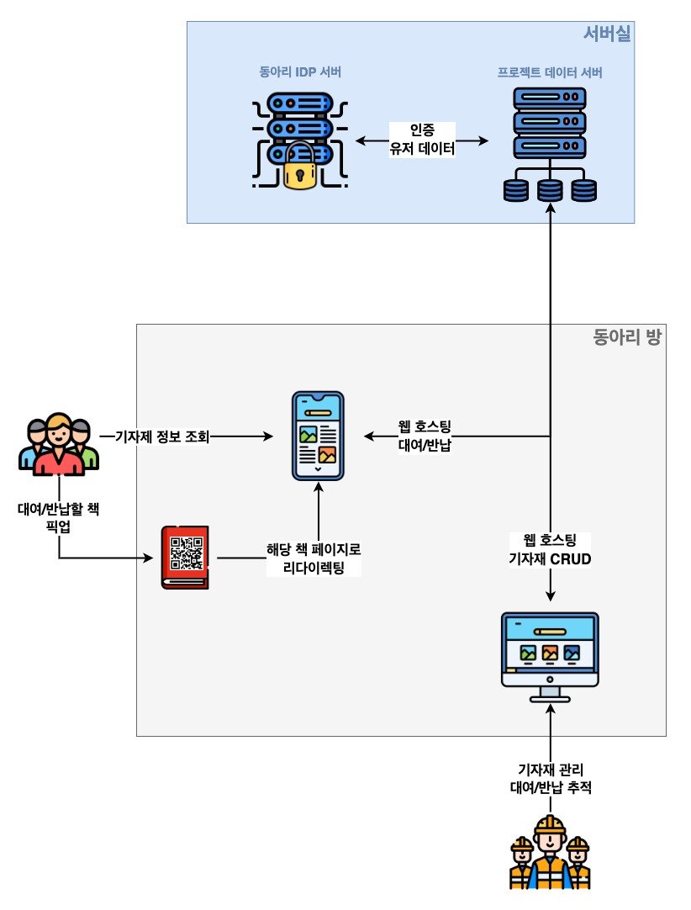
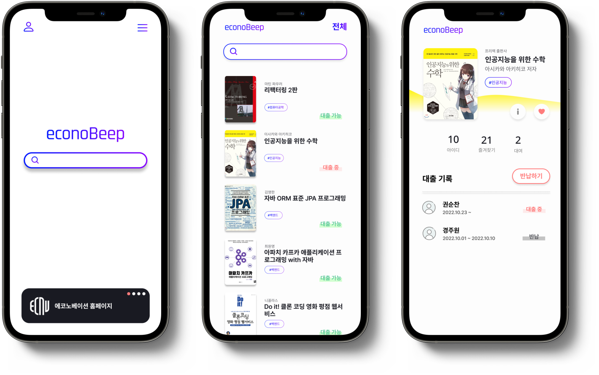
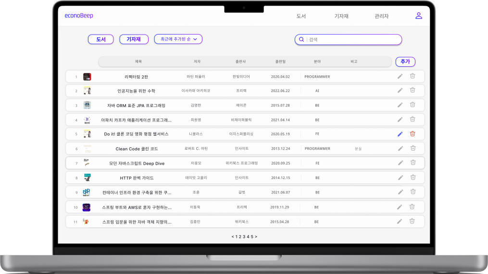
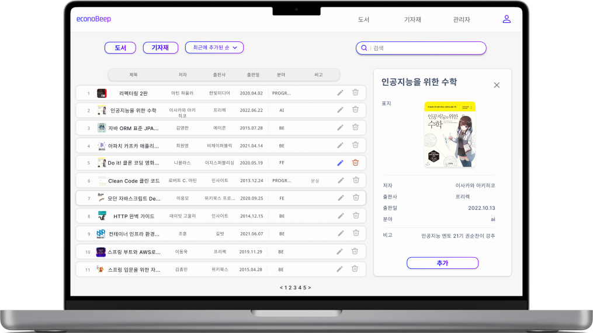
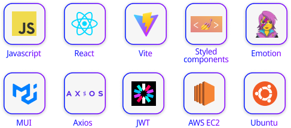
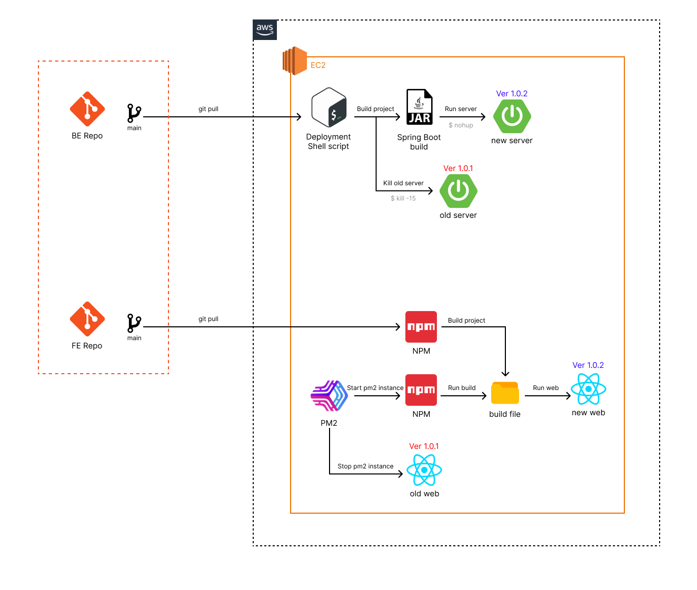

<h2>에코노베이션 기자재 관리 플랫폼, 에코노 삡</h2>

[프론트 레포](https://github.com/JNU-econovation/econo-beep-2.0) / [백엔드 레포](https://github.com/JNU-econovation/econo-beep-server) 

# 📝 소개
에코노 삡은 전남대학교 IT 개발 동아리, 에코노베이션의 대여 가능한 기자재를 관리 및 이용하는 플랫폼입니다.

- 에코노베이션 관리부는 기자재를 편리하게 유지 및 보수하고, 대여 및 반납의 기록을 추적할 수 있습니다.
- 에코노베이션 부원들은 기자재 목록과 상태를 조회하고, 기자재를 대여하거나 반납할 수 있습니다.

 

### 🚀 개요도

 

### 🚨 개발 배경
- 관리부로서 부원들에게 제공되는 기자재를 어떻게하면 **효율적으로 잘 관리할 수 있을지**에 대한 고민에서 시작
- 엑셀과 구두 전달로 기자재 유지보수, 대여 및 반납을 처리하는 기존 방식의 문제
    - 명료하지 않고 복잡한 대여/반납 과정
    - 구두로 듣고 손으로 작성하는 과정에서 생기는 기록 손실과 오류
- 따라서 **부원들이 각자 대여반납**을 할 수 있고, **관리부는 유지보수를 잘 할 수 있는 웹 플랫폼** 개발

 

### 🎯트러블 슈팅
- 과거부터 동아리원들을 위한 프로젝트가 계속 개발되고 있으나, 체계적으로 관리되고 있지 않음.
    - 프로젝트 간의 겹치는 기능, 특히 로그인/회원가입 기능을 위해 같은 코드를 매번 개발하고 있고, 동일한 유저(동아리원)의 데이터임에도 각 서비스에서 관리하고 있음.  
		⇒ 마이크로서비스화해서 통합 관리 ⇒ [ECONO-IDP](https://github.com/JNU-econovation/ECONOVATION_IDP)

 

# 💻 서비스 화면
### 홈페이지 (홈, 기자재 목록, 기자재 상세)

 

### 관리자 페이지 - 기자재 목록

 

### 관리자 페이지 - 기자재 유지보수

 

 

# 🛠️ 기술 스택
### Front-end

### Back-end

### Deployment pipeline

 

# 🧑‍💻👩‍💻 멤버

|                        Backend, Infra                         |                          Frontend                          |
|:-------------------------------------------------------------:|:----------------------------------------------------------:|
|  |  |
|               [권순찬](https://github.com/Kwon770)               |              [경주원](https://github.com/j8won)               |                                                                                                           |                                                                                                         |
